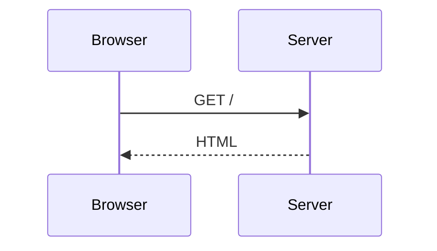

# @sigx/mermaid

[Mermaid](https://mermaid.js.org/) diagrams for [sigx](https://sigx.dev/) — a
`<Mermaid>` component for any sigx app, and drop-in ```` ```mermaid ```` fence support
for [`@sigx/ssg`](https://sigx.dev/ssg/) sites.

## 📚 Documentation

Full guides, API reference and live examples → **<https://sigx.dev/>**

## Why this exists

A docs site without diagrams explains architecture in prose. This package makes
```` ```mermaid ```` fences just work, without giving up the things a static site is
for: the diagram source stays in the HTML, mermaid loads only on pages that have
a diagram and only once one scrolls into view, and diagrams re-theme when the
reader flips light/dark.

`@sigx/ssg` needs no changes to support it. `markdown.shiki.skipLanguages` was
already the documented seam for exactly this.

## Quick start

```sh
pnpm add @sigx/mermaid mermaid
```

```ts
// ssg.config.ts
import { defineSSGConfig } from '@sigx/ssg';
import { rehypeMermaid } from '@sigx/mermaid/ssg';

export default defineSSGConfig({
    markdown: {
        shiki: { skipLanguages: ['mermaid'] },
        rehypePlugins: [rehypeMermaid],
    },
    clientImports: ['@sigx/mermaid/styles', '@sigx/mermaid/client'],
});
```

Then write a fence:

````mdx

````

In a `.tsx` page or a plain sigx app, use the component instead:

```tsx
import { Mermaid } from '@sigx/mermaid';

<Mermaid code="graph TD; A-->B;" title="Request flow" />;
```

See [`packages/mermaid/README.md`](./packages/mermaid/README.md) for the full
API, configuration, and the two integration caveats worth knowing about.

## Layout

```
mermaid/
├── packages/
│   └── mermaid/          # @sigx/mermaid — the library
└── examples/
    └── basic/            # @sigx/ssg site + e2e fixture
```

## Packages

| Package | Description |
| --- | --- |
| [`@sigx/mermaid`](./packages/mermaid/README.md) | `<Mermaid>` component, client-side fence enhancement, and the `rehypeMermaid` plugin for `@sigx/ssg`. |

## Development

```sh
pnpm install
pnpm build        # tsgo → packages/mermaid/dist
pnpm test         # vitest run — run `pnpm build` first, the e2e test needs dist
pnpm typecheck
pnpm lint
```

Run the example site with `pnpm --filter @sigx-examples/mermaid-basic dev`.

Contributions follow the sigx standard workflow — see
[`CONTRIBUTING.md`](./CONTRIBUTING.md) and, for AI agents,
[`AGENTS.md`](./AGENTS.md).

## License

MIT
