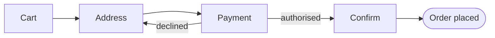
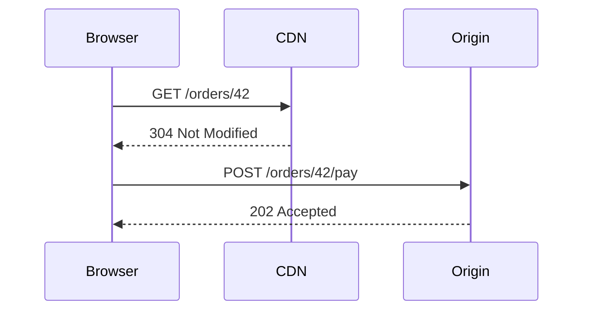
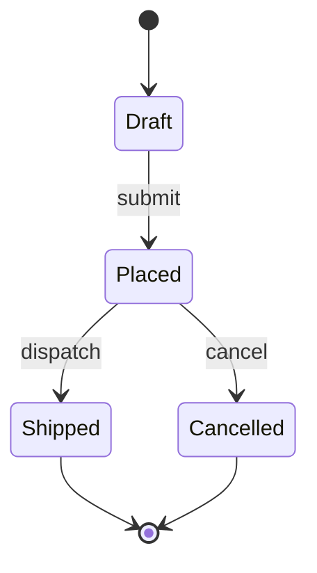
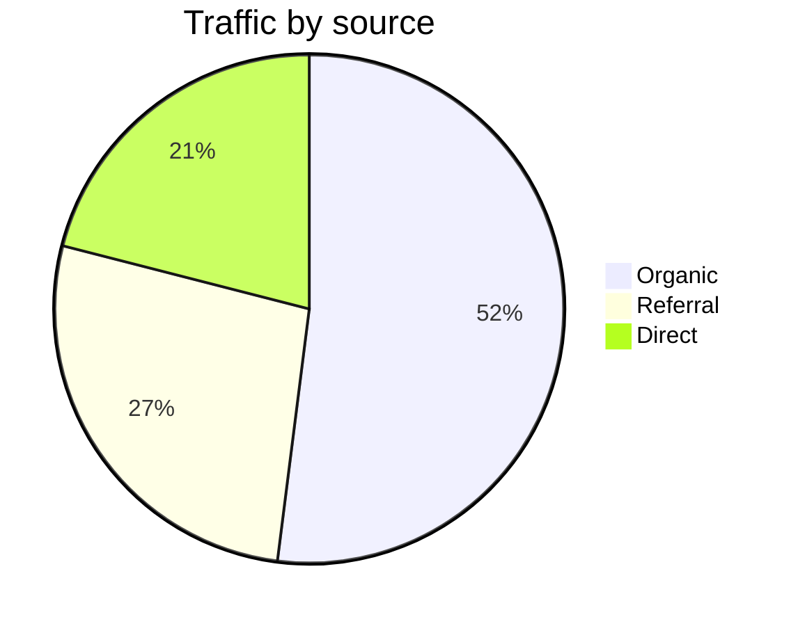

# Diagrams

Every block below is a plain ` ```mermaid ` fence in the MDX source. The build
leaves the source in the HTML; `@sigx/mermaid/client` swaps in an SVG once the
diagram scrolls into view.

## Flowchart



## Sequence



## State



## Pie



## Other fences are left alone

`rehypeMermaid` claims `language-mermaid` and nothing else — this block renders
however the site normally renders code.

```ts
import { Mermaid } from '@sigx/mermaid';

export function Architecture() {
    return <Mermaid code="graph LR; Client-->API-->DB;" title="Services" />;
}
```

[Second page](/second/) — used by the e2e test to check SPA navigation.
