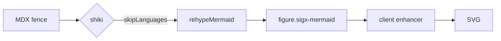
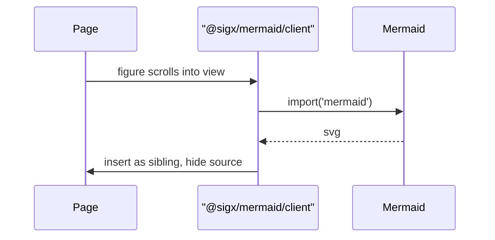

# Diagrams

Every fenced block below is a plain ` ```mermaid ` fence in the MDX source. The
build leaves the source in the HTML; `@sigx/mermaid/client` swaps in an SVG once
the diagram scrolls into view.

## Flowchart



## Sequence



## A code fence that is *not* a diagram

Shiki still owns every other language — `skipLanguages` only takes `mermaid`
out of its hands.

```ts
export default defineSSGConfig({
    markdown: {
        shiki: { skipLanguages: ['mermaid'] },
        rehypePlugins: [rehypeMermaid],
    },
});
```

[Second page](/second/) — used by the e2e test to check SPA navigation.
