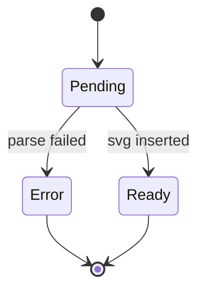

# Second page

Reached from the [home page](/) through `@sigx/ssg`'s client-side navigation.
That swap dispatches no event, so the enhancer notices the new markup with a
`MutationObserver` — this page exists to prove it.



## Invalid on purpose

An unparseable diagram must leave its source visible rather than a blank frame.

```mermaid
graph TD
  this is not )( valid mermaid
```
