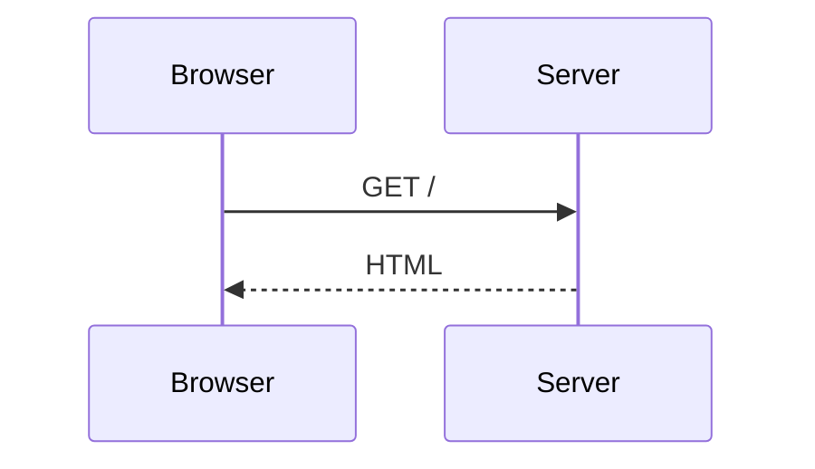

# @sigx/mermaid

[Mermaid](https://mermaid.js.org/) diagrams for [sigx](https://sigx.dev/).

- a `<Mermaid>` component for any sigx app
- drop-in ` ```mermaid ` fence support for [`@sigx/ssg`](https://sigx.dev/ssg/)
- diagrams follow the page's light/dark theme, re-rendering when it flips
- mermaid loads lazily — only on pages with a diagram, only once one is near the
  viewport

## Installation

```sh
pnpm add @sigx/mermaid mermaid
```

`mermaid` and `sigx` are **peer dependencies**; this package has no runtime
dependencies of its own. You control mermaid's version.

## Use with @sigx/ssg

```ts
// ssg.config.ts
import { defineSSGConfig } from '@sigx/ssg';
import { rehypeMermaid } from '@sigx/mermaid/ssg';

export default defineSSGConfig({
    markdown: {
        // Both lines are required. `skipLanguages` stops shiki from claiming
        // the fence; site rehype plugins run after shiki, so rehypeMermaid
        // then finds the raw <pre><code class="language-mermaid">.
        shiki: { skipLanguages: ['mermaid'] },
        rehypePlugins: [rehypeMermaid],
    },
    clientImports: ['@sigx/mermaid/styles', '@sigx/mermaid/client'],
});
```

Every other language still goes through shiki as usual.

````mdx

````

The optional `title="…"` fence meta becomes a `<figcaption>` and the SVG's
accessible name.

### What lands in the HTML

```html
<figure class="sigx-mermaid" data-sigx-mermaid data-mermaid-title="Request flow">
  <pre class="sigx-mermaid-source"><code>sequenceDiagram…</code></pre>
  <figcaption class="sigx-mermaid-caption">Request flow</figcaption>
</figure>
```

No SVG — see [Why not build-time?](#why-not-build-time) below. On the client,
`@sigx/mermaid/client` inserts a `.sigx-mermaid-output` **sibling** holding the
SVG and hides the source `<pre>`. It never renders over the server markup, so
there is no hydration divergence, and a diagram that fails to parse keeps its
source visible with `data-mermaid-state="error"`.

`data-mermaid-state` moves `pending` → `ready` | `error`; style against it.

The attribute is **absent from the SSR output** and appears only once the client
claims the figure. That is deliberate: `pending` means "JavaScript has this and
is working on it", which is a claim the server cannot make. Emitting `pending`
statically would leave a reader with no JavaScript looking at a box that says it
is loading forever — and any CSS reserving space for it would hold that space
open permanently. With no attribute, the source `<pre>` is simply visible, which
is the correct no-JS presentation. Style the absent case with
`.sigx-mermaid:not([data-mermaid-state])` if you need to.

### Without the rehype plugin

The plugin is optional. `@sigx/mermaid/client` also claims a bare
`pre > code.language-mermaid`, wrapping it in the same figure at runtime, so
`skipLanguages` + `clientImports` alone is a working setup. What the plugin adds
is the caption, a reserved box that stops the page jumping when the SVG lands,
and markup that exists before JavaScript runs.

## Use as a component

```tsx
import { Mermaid } from '@sigx/mermaid';

<Mermaid code="graph TD; A-->B;" title="Flow" />
<Mermaid code={source} eager />
```

| Prop | Type | Description |
| --- | --- | --- |
| `code` | `string` | The diagram definition. Required. |
| `title` | `string` | Rendered as a `<figcaption>` and the SVG's accessible name. |
| `class` | `string` | Extra classes on the `<figure>`. |
| `options` | `MermaidOptions` | Per-instance overrides, merged over the global config. |
| `eager` | `boolean` | Render on mount instead of on scroll-into-view. Default `false`. |

## Configuration

```ts
// src/mermaid-config.ts
import { configureMermaid } from '@sigx/mermaid';

configureMermaid({
    themes: { light: 'neutral', dark: 'dark' },
    config: { flowchart: { curve: 'basis' } },
});
```

```ts
// ssg.config.ts — the config module must come BEFORE the client entry,
// which installs itself on import.
clientImports: ['./src/mermaid-config', '@sigx/mermaid/client'];
```

| Option | Default | Description |
| --- | --- | --- |
| `themes` | `{ light: 'default', dark: 'dark' }` | Appearance per colour scheme — see below. |
| `securityLevel` | `'strict'` | Passed to mermaid. Raising it lets diagrams emit raw HTML and click handlers. |
| `config` | `{}` | Merged into `mermaid.initialize()`. `themeVariables` merges rather than replaces. |
| `resolveColorScheme` | — | Override colour-scheme detection entirely. |

### Matching your site's colours

Each scheme takes either a mermaid theme name or `{ theme, variables }`, so
light and dark can carry different palettes:

```ts
configureMermaid({
    themes: {
        light: { theme: 'base', variables: { primaryColor: '#f6f8fa', lineColor: '#d1d9e0' } },
        dark: { theme: 'base', variables: { primaryColor: '#161b22', lineColor: '#3d444d' } },
    },
});
```

Pair `variables` with **`theme: 'base'`** — `base` is the theme mermaid intends
to be recoloured; the others largely ignore overrides.

`variables` may be a **function**, evaluated at render time rather than at
config time. That is how you drive diagrams from CSS custom properties, so they
track a daisyUI or Tailwind theme swap without you restating the palette:

```ts
const cssVar = (n: string) => getComputedStyle(document.documentElement).getPropertyValue(n).trim();

const fromTokens = () => ({
    background: cssVar('--b1'),
    primaryColor: cssVar('--b2'),
    primaryTextColor: cssVar('--bc'),
    lineColor: cssVar('--bc'),
});

configureMermaid({
    themes: { light: { theme: 'base', variables: fromTokens }, dark: { theme: 'base', variables: fromTokens } },
});
```

A working version of this is in [`examples/basic`](../../examples/basic/src/mermaid-config.ts).

Precedence, lowest first: **package defaults** → global `config` → per-call
`options.config` → the active scheme's `variables`. `themeVariables` merges at
each step, so overriding one colour keeps the rest.

### What the package sets for you

One variable, and only when the page's background is readable:

| Variable | Default | Why |
| --- | --- | --- |
| `edgeLabelBackground` | the page background | mermaid hardcodes a light grey in every built-in theme, *including the dark ones*, so an edge label lands as a highlighter smear across a dark diagram. The page background rather than `transparent`, because the chip's job is to occlude the line running under it. |

Set it yourself to override, `'transparent'` included. When no background is
painted the canvas is white — which is what mermaid's default already assumes —
so nothing is applied.

### Theme detection

In order, first match wins:

1. an explicit `resolveColorScheme`
2. `data-theme` of exactly `light` / `dark` on `<html>`
3. the *computed* `color-scheme` — how named daisyUI themes like `night` or
   `cupcake` resolve
4. a `.dark` class on `<html>` (the Tailwind convention)
5. the page's actual background colour

Note what is **not** in that list: `prefers-color-scheme`. A page that hasn't
opted into dark mode renders light no matter what the OS prefers, so keying off
the OS puts a dark diagram on a white page. Reading the background answers the
question actually being asked — *is this diagram about to sit on something
dark?* — and it works whether the site themes itself with `data-theme`, a class,
or a bare `@media (prefers-color-scheme: dark)` block that declares no
`color-scheme`. A page with no background at all is canvas white, so: light.

If your page is dark in a way none of these can see, say so directly:

```ts
configureMermaid({ resolveColorScheme: () => (myStore.dark ? 'dark' : 'light') });
```

When the resolved appearance changes, already-rendered diagrams re-render.
Diagrams that haven't drawn yet simply pick up the new theme when they do.

"Changes" means the colour scheme, the theme name, *or* the resolved
`variables` — all three, because with per-scheme variables both schemes usually
name `base`, and a daisyUI swap between two light themes changes neither the
scheme nor the name while changing every colour.

The watcher fires on `data-theme` / `class` / `style` mutations on `<html>` and
on `prefers-color-scheme`. A theme delivered purely by swapping a stylesheet is
not observable — call `renderDiagram` again, or toggle an attribute.

## Styling

`@sigx/mermaid/styles` is cosmetic — everything functional is done in JS with the
`hidden` attribute, so a site that skips the stylesheet still behaves correctly.
Override the custom properties on `.sigx-mermaid`:

`--sigx-mermaid-gap`, `--sigx-mermaid-radius`, `--sigx-mermaid-padding`,
`--sigx-mermaid-bg`, `--sigx-mermaid-border`, `--sigx-mermaid-muted`,
`--sigx-mermaid-error`, `--sigx-mermaid-min-height`.

## Caveats

**1. `clientImports` is ignored when your project has a custom client entry.**
`@sigx/ssg` skips the generated entry — and with it `clientImports` — when it
detects `src/main.tsx` or similar. Those projects must import the client module
themselves:

```ts
// src/main.tsx
import '@sigx/mermaid/styles';
import '@sigx/mermaid/client';
```

**2. mermaid is heavy to pre-bundle.** It pulls in d3, cytoscape and katex.
Exclude it from Vite's dependency optimizer to keep dev-server cold start fast —
it is dynamically imported either way, so it still gets its own chunk:

```ts
// vite.config.ts
export default defineConfig({
    optimizeDeps: { exclude: ['mermaid'] },
});
```

## Why not build-time?

Rendering to SVG during the build would mean zero client JavaScript, and it is
the obvious thing to want. mermaid can't do it without a browser: it measures
text with `getBBox`, which neither jsdom nor happy-dom implements faithfully.
The options are a headless Chromium (slow builds, a ~300 MB dependency) or
`isomorphic-mermaid` (svgdom-based, young, and approximate on font metrics).

Neither is a good default, so this package renders on the client and keeps the
cost honest: the source is always in the HTML, and mermaid is never loaded for a
diagram nobody scrolled to. A build-time prerenderer behind an optional peer
dependency is a plausible future addition.

## API

```ts
// @sigx/mermaid
export { Mermaid, type MermaidProps };
export { configureMermaid, getMermaidConfig, resetMermaidConfig, mergeMermaidConfig };
export { loadMermaid, renderDiagram, resolveColorScheme, resolveTheme, resolveSchemeTheme, watchTheme };
export type {
    MermaidOptions, MermaidSchemeTheme, MermaidThemeName, MermaidThemes,
    MermaidThemeVariables, RenderResult,
};

// @sigx/mermaid/client   — installs on import
export { installMermaid, uninstallMermaid, type MermaidClientOptions };

// @sigx/mermaid/ssg
export { rehypeMermaid, mermaidThemeContribution, type RehypeMermaidOptions };
```

## License

MIT
