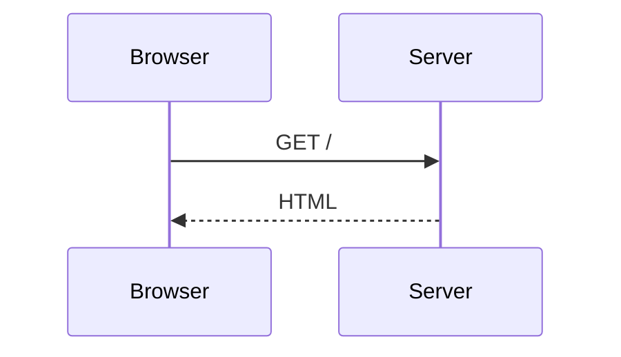

# Using @sigx/mermaid with @sigx/ssg

`@sigx/mermaid` is a generic sigx component — see the
[package README](../README.md) for the component, theming and styling, all of
which apply here unchanged. This page covers only the extra wiring that turns
```` ```mermaid ```` fences in MDX into diagrams.

`@sigx/ssg` has no knowledge of mermaid and does not depend on it. What it
provides is a generic seam — `markdown.shiki.skipLanguages` hands a fence
language to a downstream plugin, and site `rehypePlugins` run after shiki — and
`@sigx/mermaid/ssg` plugs into it. Nothing in ssg needs to change to support
diagrams.

## Wiring

```ts
// ssg.config.ts
import { defineSSGConfig } from '@sigx/ssg';
import { rehypeMermaid } from '@sigx/mermaid/ssg';

export default defineSSGConfig({
    markdown: {
        // Both lines are required. `skipLanguages` stops shiki from claiming
        // the fence; site rehype plugins run after shiki, so rehypeMermaid
        // then finds the raw <pre><code class="language-mermaid">.
        shiki: { skipLanguages: ['mermaid'] },
        rehypePlugins: [rehypeMermaid],
    },
    clientImports: ['@sigx/mermaid/styles', '@sigx/mermaid/client'],
});
```

Every other language still goes through shiki as usual.

If you call `configureMermaid()`, its module must come **before**
`@sigx/mermaid/client` in `clientImports` — the client installs itself on
import, so configuration has to be in place first:

```ts
clientImports: ['./src/mermaid-config', '@sigx/mermaid/client'];
```

````mdx

````

The optional `title="…"` fence meta becomes a `<figcaption>` and the SVG's
accessible name.

### What lands in the HTML

```html
<figure class="sigx-mermaid" data-sigx-mermaid data-mermaid-title="Request flow">
  <pre class="sigx-mermaid-source"><code>sequenceDiagram…</code></pre>
  <figcaption class="sigx-mermaid-caption">Request flow</figcaption>
</figure>
```

No SVG — see [Why not build-time?](../README.md#why-not-build-time). On the client,
`@sigx/mermaid/client` inserts a `.sigx-mermaid-output` **sibling** holding the
SVG and hides the source `<pre>`. It never renders over the server markup, so
there is no hydration divergence, and a diagram that fails to parse keeps its
source visible with `data-mermaid-state="error"`.

`data-mermaid-state` moves `pending` → `ready` | `error`; style against it.

The attribute is **absent from the SSR output** and appears only once the client
claims the figure. That is deliberate: `pending` means "JavaScript has this and
is working on it", which is a claim the server cannot make. Emitting `pending`
statically would leave a reader with no JavaScript looking at a box that says it
is loading forever — and any CSS reserving space for it would hold that space
open permanently. With no attribute, the source `<pre>` is simply visible, which
is the correct no-JS presentation. Style the absent case with
`.sigx-mermaid:not([data-mermaid-state])` if you need to.

### Without the rehype plugin

The plugin is optional. `@sigx/mermaid/client` also claims a bare
`pre > code.language-mermaid`, wrapping it in the same figure at runtime, so
`skipLanguages` + `clientImports` alone is a working setup. What the plugin adds
is the caption, a reserved box that stops the page jumping when the SVG lands,
and markup that exists before JavaScript runs.

## Caveats

**1. `clientImports` is ignored when your project has a custom client entry.**
`@sigx/ssg` skips the generated entry — and with it `clientImports` — when it
detects `src/main.tsx` or similar. Those projects must import the client module
themselves:

```ts
// src/main.tsx
import '@sigx/mermaid/styles';
import '@sigx/mermaid/client';
```

**2. mermaid is heavy to pre-bundle.** It pulls in d3, cytoscape and katex.
Exclude it from Vite's dependency optimizer to keep dev-server cold start fast —
it is dynamically imported either way, so it still gets its own chunk:

```ts
// vite.config.ts
export default defineConfig({
    optimizeDeps: { exclude: ['mermaid'] },
});
```
