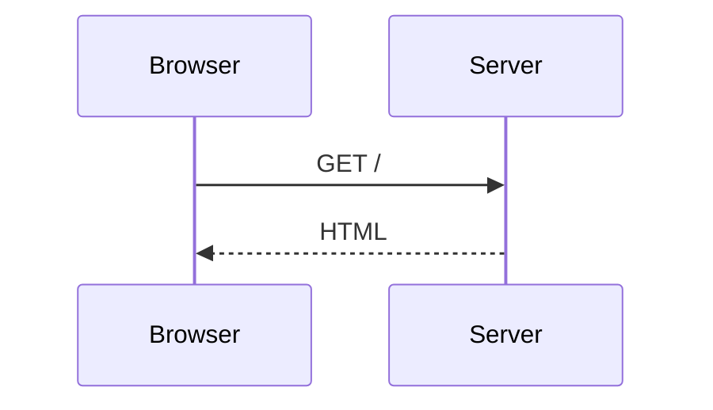

# Using @sigx/mermaid with @sigx/ssg

`@sigx/mermaid` is a generic sigx component — see the
[package README](../README.md) for the component, theming and styling, all of
which apply here unchanged. This page covers only the extra wiring that turns
```` ```mermaid ```` fences in MDX into diagrams.

`@sigx/ssg` has no knowledge of mermaid and does not depend on it. What it
provides is a generic seam — site-supplied markdown plugins — and
`@sigx/mermaid/ssg` plugs into it. Nothing in ssg needs to change to support
diagrams.

## Wiring

```ts
// ssg.config.ts
import { defineSSGConfig } from '@sigx/ssg';
import { remarkMermaid } from '@sigx/mermaid/ssg';

export default defineSSGConfig({
    markdown: {
        remarkPlugins: [remarkMermaid],
    },
    clientImports: ['@sigx/mermaid/styles', '@sigx/mermaid/client'],
});
```

That is the whole integration. `remarkMermaid` claims the fence on the
markdown tree, before HTML conversion, so nothing downstream of it ever sees
the fence — every other fence is untouched and rendered however the site
normally renders code.

`@sigx/mermaid/ssg` exports two plugins; they emit the identical figure shell
and differ only in which stage of the pipeline hands them the tree:

- **`remarkMermaid`** runs on the markdown tree (`markdown.remarkPlugins`). It
  claims the fence before HTML conversion and needs nothing else.
- **`rehypeMermaid`** runs on the HTML tree (`markdown.rehypePlugins`). It
  claims whatever `<pre><code class="language-mermaid">` is still in the tree
  when it runs — what reaches it is decided by the plugins ordered before it.

If you call `configureMermaid()`, its module must come **before**
`@sigx/mermaid/client` in `clientImports` — the client installs itself on
import, so configuration has to be in place first:

```ts
clientImports: ['./src/mermaid-config', '@sigx/mermaid/client'];
```

````mdx

````

The optional `title="…"` fence meta becomes a `<figcaption>` and the SVG's
accessible name.

### What lands in the HTML

```html
<figure class="sigx-mermaid" data-sigx-mermaid data-mermaid-title="Request flow">
  <pre class="sigx-mermaid-source">sequenceDiagram…</pre>
  <figcaption class="sigx-mermaid-caption">Request flow</figcaption>
</figure>
```

No SVG — see [Why not build-time?](../README.md#why-not-build-time). On the client,
`@sigx/mermaid/client` inserts a `.sigx-mermaid-output` **sibling** holding the
SVG and hides the source `<pre>`. It never renders over the server markup, so
there is no hydration divergence, and a diagram that fails to parse keeps its
source visible with `data-mermaid-state="error"`.

`data-mermaid-state` moves `pending` → `ready` | `error`; style against it.

The attribute is **absent from the SSR output** and appears only once the client
claims the figure. That is deliberate: `pending` means "JavaScript has this and
is working on it", which is a claim the server cannot make. Emitting `pending`
statically would leave a reader with no JavaScript looking at a box that says it
is loading forever — and any CSS reserving space for it would hold that space
open permanently. With no attribute, the source `<pre>` is simply visible, which
is the correct no-JS presentation. Style the absent case with
`.sigx-mermaid:not([data-mermaid-state])` if you need to.

### Without a plugin

The plugins are optional. `@sigx/mermaid/client` also claims a bare
`pre > code.language-mermaid`, wrapping it in the same figure at runtime — a
working setup whenever the fence reaches the HTML in that shape. What a plugin
adds is the caption, a reserved box that stops the page jumping when the SVG
lands, and markup that exists before JavaScript runs.

### Contributing it from a theme

`mermaidThemeContribution` is a drop-in fragment for an `@sigx/ssg` **theme** —
spread it into the theme's `ThemeConfig` and every site using that theme gets
diagrams with no site-level configuration:

```ts
import { mermaidThemeContribution } from '@sigx/mermaid/ssg';

export const themeConfig = {
    // …the theme's own config…
    markdown: { ...mermaidThemeContribution.markdown },
    css: [...mermaidThemeContribution.css],
};
```

## Caveats

**1. `clientImports` is ignored when your project has a custom client entry.**
`@sigx/ssg` skips the generated entry — and with it `clientImports` — when it
detects `src/main.tsx` or similar. Those projects must import the client module
themselves:

```ts
// src/main.tsx
import '@sigx/mermaid/styles';
import '@sigx/mermaid/client';
```

**2. Tell Vite's dependency optimizer about mermaid.** mermaid is imported
lazily, only once a diagram nears the viewport, so the dev server's dependency
scanner never discovers it — and un-optimized, its CJS dependencies (dayjs
among them) are served raw in dev and fail to load as ES modules. Name it
explicitly:

```ts
// vite.config.ts
export default defineConfig({
    optimizeDeps: { include: ['mermaid'] },
});
```

If mermaid is not a direct dependency of your app, use
`optimizeDeps.include: ['@sigx/mermaid > mermaid']`. Production builds are
unaffected either way.
